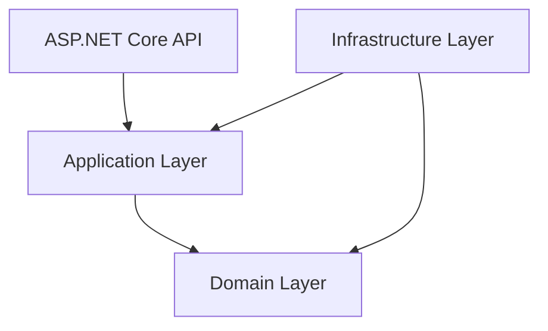

# BoardGameHub
Бекэнд приложение для управления сессиями настольных игр. Разрабатывается в соответствии с принципами REST API, чистой архитектуры и DDD
## Цель

BoardGameHub — это pet-проект для практики современных подходов к backend-разработке и демонстрации инженерных навыков.
Основная цель проекта — экспериментировать и применять на практике:
- принципы Clean Architecture;
- паттерны и подходы Domain-Driven Design;
- разработку backend API на ASP.NET Core;
- проектирование работы с данными;
- стратегии тестирования;
- практики разработки, приближенные к production.
Проект не является коммерческим продуктом. Его цель — обучение, проверка архитектурных подходов и создание портфолио.
## Архитектура

## Технологии
.NET 10
ASP.NET Core
Clean Architecture
DDD
AutoMapper
NUnit
## Доменная модель
Два простых агрегата, состоящих из одной сущности: BoardGame и GameSession. Набор доменных исключений.
## Текущее состояние и функционал
Состояние проекта:
- Хранилища в памяти
- На доменном уровне: агрегаты, сущности, value objects с проверкой инвариантов; доменные исключения
- AutoMapper для маппинга данных на уровне Application
- Тесты для Application и Domain
Функционал:
 - Получить список настольных игр, получить настольную игру по идентификатору, создать новую настольную игру
 - Получить список игровых сессий, получить игровую сессию по идентификатору, создать новую игровую сессию
## Функциональная дорожная карта
### Фаза 1- Ядро для игр
[x] Создание и просмотр настольных игр
[x] Создание и просмотр игровых сессий
[ ] Присоединиться к игровой сессии
[ ] Покинуть сессию
[ ] Обслуживание лимитов количества игроков в сессиях
### Фаза 2 - Сообщество игроков 
[ ] Регистрация и авторизация пользователей 
[ ] Профиль игрока: (имя; список любимых игр; история участия в сессиях)
[ ] Система рейтингов настольных игр
[ ] Отзывы игроков о настольных играх 
[ ] Избранные игры
### Фаза 3 - Игровые клубы и мероприятия 
[ ] Создание игровых клубов 
[ ] Управление участниками клуба -
[ ] Создание мероприятий клуба 
[ ] Поиск открытых игровых сессий рядом
[ ] Запись игроков на мероприятия
## Техническая дорожная карта 
### Архитектура 
[x] Базовая структура Clean Architecture 
[x] Разделение Domain и Application слоёв 
[ ] Уточнить границы агрегатов 
Задачи: 
- добавить сущность игрока Player
- определить Aggregate Root для каждого агрегата
- определить инварианты каждого агрегата 
- закрыть публичные setter у доменных объектов 
- заменить изменение состояния через методы агрегатов 
- перенести бизнес-правила из Application в Domain 
- документировать связи между агрегатами
[ ] Добавление доменных событий
[ ] Документирование архитектурных решений (ADR) 
### Работа с данными 
[ ] Переход с InMemory-репозиториев на PostgreSQL + EF Core 
[ ] Настройка миграций базы данных 
[ ] Добавление интеграционных тестов с реальной БД ### API 
[ ] Единый механизм обработки ошибок 
[ ] Стандартизированные ответы API (ProblemDetails) 
[ ] Валидация входных данных через pipeline 
[ ] Пагинация и фильтрация запросов 
### Инфраструктура
[ ] Запуск приложения через Docker Compose 
[ ] Настройка конфигурации через переменные окружения 
[ ] Структурированное логирование 
[ ] Health Checks
### Качество кода 
[x] Unit-тесты для Domain и Application 
[ ] Интеграционные тесты 
[ ] CI/CD pipeline 
[ ] Контроль покрытия тестами
